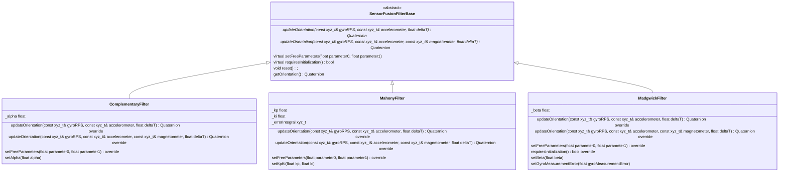

# Sensor Fusion

This library contains [sensor fusion](https://en.wikipedia.org/wiki/Sensor_fusion) algorithms to combine
output from a gyroscope, accelerometer, and optionally a magnetometer to give output that has less uncertainty
than the output of the individual sensors.

Four sensor fusion algorithms are provided:

1. Complementary Filter
2. Mahony Filter
3. Madgwick Filter
4. Versatile Quaternion-based Filter (VQF)

The Madgwick filter has been refactored to be more computationally efficient (and so faster) than
the standard version used in many implementations (Arduino, Adafruit, M5Stack, Reefwing-AHRS),
[see MadgwickRefactoring](https://github.com/martinbudden/Library-SensorFusion/blob/main/documents/MadgwickRefactoring.md) for details.

## Coordinate convention

This sensor fusion library uses the *ENU*(East North Up) coordinate convention. The *ENU* convention is commonly used by cars
and other land vehicles. It is also used by the [Robot Operating System](https://en.wikipedia.org/wiki/Robot_operating_system) (ROS).

### Converting to *NED*(North East Down) coordinate convention

The *NED* convention is commonly used in aircraft and aerospace applications.

This library does not provide functions to return values in *NED* coordinates since it is computationally more
efficient for the application to convert only the coordinates it uses.

Conversion of vectors is straightforward. If `vENU` is a vector in *ENU* coordinates and `vNED` a vector in *NED* coordinates, then

```cpp
vNED.x = vENU.y;
vNED.y = vENU.x;
vNED.z = -vENU.z;
```

For quaternions, to convert from *ENU* to *NED* we need to rotate the quaternion 180° around the vector [1 0 0].

This rotation is represented by the quaternion <sup>ENU</sup><sub>NED</sub>**q** = [ 0 sin45° sin45° 0 ] = [ 0  √2/2 √2/2 0 ]

If `qENU` is a quaternion in *ENU* coordinates and `qNED` a quaternion in *NED* coordinates, then

```cpp
const Quaternion qENUtoNED(0.0F, sqrtf(2.0F)/2.0F, sqrtf(2.0F)/2.0F, 0.0F);
qNED = qENUtoNED * qENU
```

If the application uses Euler angles, then these can be directly obtained using the converted orientation's Euler angle calculation functions:

```cpp
const Quaternion orientationENU = sensorFusionFilter.updateOrientation(gyroRPS, acc, deltaT);
const Quaternion orientationNED = qENUtoNED * orientationENU;
const float rollNED_degrees = orientationNED.calculateRollDegrees();
const float pitchNED_degrees = orientationNED.calculatePitchDegrees();
const float yawNED_degrees = orientationNED.calculateYawDegrees();
```

## Simplified class diagram

VQF (Versatile Quaternion-based Filter) not shown


